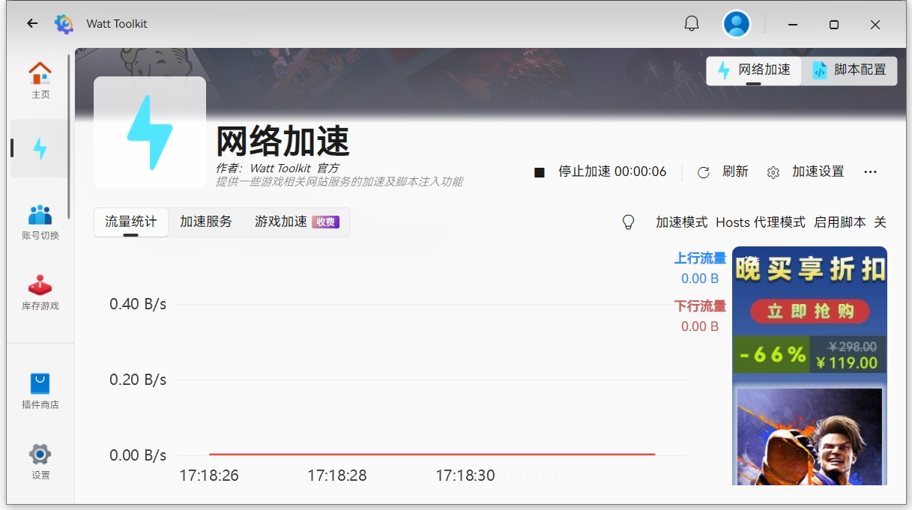
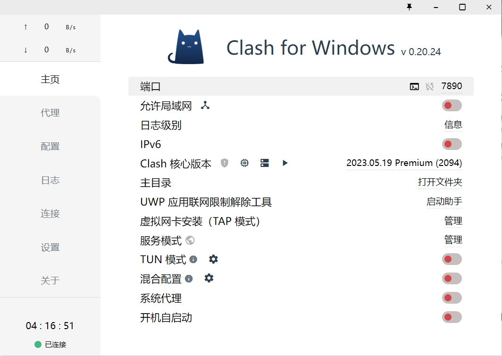

# github网站使用说明
### 性质

- github是一个**代码网盘**，我们可以把写好的代码存储在这里，节省电脑空间，方便工程管理
- github是一个**开源圣地**，除了看到我们自己的代码，还可以看到别人让你看的代码，可以互相学习

### 使用工具

想要用好github，必先要有好的工具

1. 加速器及翻墙软件，加速器我这里推荐steam++，这个除了可以用来加速steam还可以加速github等多个网站
   - 有了加速器，我们浏览github的时候才能流畅加载
   - 
   - 翻墙软件的话，我这里推荐Clash for Windows
   - 
   - 值得注意的是，Clash for Windows只是一个翻墙工具，**节点是要另外买的**。讲人话就是翻墙工具是梯子，节点就是帮你找到那个有缺口的墙，两者合二为一才可以实现翻墙。
   - 节点购买网站我这里推荐https://home.xfx.life 节点的费用并不算贵，正常使用1年也用不到30G，正常人买流量用完为止套餐即可，费用基本就在50块左右
   - 顺带一提，**加速器和翻墙软件在浏览github是非常重要的**，没有他们，**别人仓库的图片你都加载不出来**，就像上面两张图片一样，他们并不是加载出错或异常，只是你的网络不行而已。
2. 翻译插件，虽然github真的很好用，但是免不了他是国外网站的事实，全部都是英文的界面看着真的很难受
   - 要下载翻译插件，首先要先下载插件加载软件[tampermonkey](https://www.tampermonkey.net/)
   - [tampermonkey油猴的下载教程](https://www.bilibili.com/video/BV1XV4y1i7CY/?spm_id_from=333.337.search-card.all.click&vd_source=60499a4850284be9bc949c4ca866b892)
   - 安装好油猴之后，就可以来安装插件了，[github中文插件](https://greasyfork.org/zh-CN/scripts/435208-github-%E4%B8%AD%E6%96%87%E5%8C%96%E6%8F%92%E4%BB%B6)，顺便可以看看[github中文插件的老家](https://github.com/maboloshi/github-chinese)
   - 至此我们的github使用准备工作就完成了

### github 2FA认证

- 所谓的2FA认证就是，**双重认证**。就像你登录账号的时候还要手机验证码验证一样，2FA认证有很多种，不过一般都是外国人才能使用的，我们能用的只有几种而已
- [2FA认证教程](https://www.bilibili.com/video/BV1Cj411b7Tu/?spm_id_from=333.337.search-card.all.click&vd_source=60499a4850284be9bc949c4ca866b892)

### github使用

- [github新手够用指南](https://www.bilibili.com/video/BV1e541137Tc/?spm_id_from=333.337.search-card.all.click&vd_source=60499a4850284be9bc949c4ca866b892)
- [github组织的基本认识](https://www.bilibili.com/video/BV16V411u7di/?spm_id_from=333.337.search-card.all.click&vd_source=60499a4850284be9bc949c4ca866b892)
